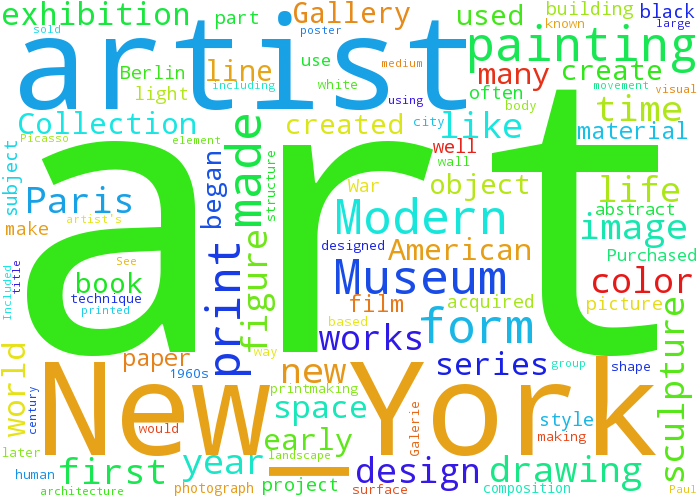

[](#status)
# Art Project - Experiment with Art Datasets using NLP

Based on MOMA, Kadist & Tate datasets, this project attempts to explore art through NLP and Machine Learning. 

The first steps is to enrich the MOMA's dataset by adding additional text for a work , this isa rich source
of interpretive text that describes the work beyond the meta data (size, date etc.) Unfortunately not many
of the works contain additional text, but for those that do I scrape the site and add the data to the csv.

This textual data will be used for 

- key phrase extraction 
- to build [word clouds](https://github.com/amueller/word_cloud), result from MOMA scraped extra txt: 
 


- word cloud from Kadist Collection 


### Plan

- scrape and enrich the meta data ✓
- ingest into elastic search ✓
- write a Kibana app to explore the data ✓
- investigate [gensim LDA](http://sujitpal.blogspot.com/2014/08/topic-modeling-with-gensim-over-past.html)

### Other Datasets

- [Tate](https://github.com/tategallery/collection)
- [MIA](https://github.com/artsmia/collection)
- [ICA Boston](http://www.icaboston.org/exhibitions/permanent-collection/artists/attia/)
- [Brooklyn Museum](https://www.brooklynmuseum.org/opencollection/collections/)

### Required Attribution:

MoMA requests that you actively acknowledge and give attribution to MoMA wherever possible. If you use the dataset for a publication, please cite it using the digital object identifier [](https://zenodo.org/badge/latestdoi/15218/MuseumofModernArt/collection). Attribution supports efforts to release other data. It also reduces the amount of “orphaned data,” helping retain links to authoritative sources.

### Notes
for gensim installation the following are prereqs:

- $ sudo apt-get install liblapack-dev
- $ sudo apt-get install gfortran

- Some interesting background on [art and machine learning](https://medium.com/the-physics-arxiv-blog/when-a-machine-learning-algorithm-studied-fine-art-paintings-it-saw-things-art-historians-had-never-b8e4e7bf7d3e)

- [gensim similarity engine](http://radimrehurek.com/gensim/simserver.html)

- Re word2vec models:

The en_1000_no_stem can only be opened using this format:

```
from gensim.models import Word2Vec
model = Word2Vec.load("en_1000_no_stem/en.model")
model.similarity('woman', 'man')
```

the other models can be opened with the usual:

```
model = Word2Vec.load_word2vec_format(model_path, binary=True)
```
(or remove binary for non binary models)


## LSI
LSI provides a way to expand terms, synonyms, hyper/hyponyms, experiment with
LSI and pyLDAvis for visualization
